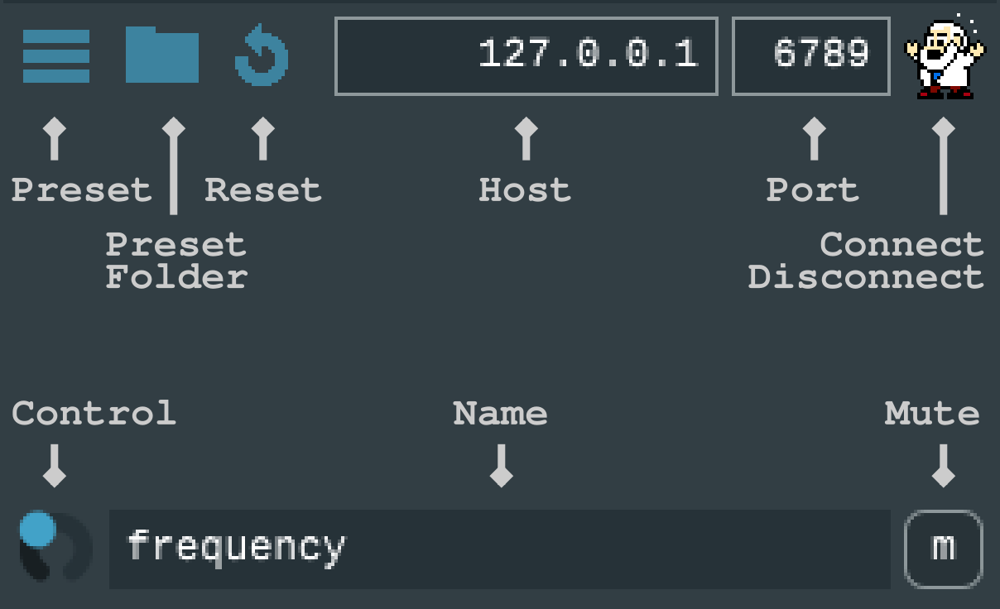
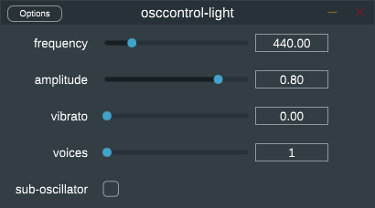
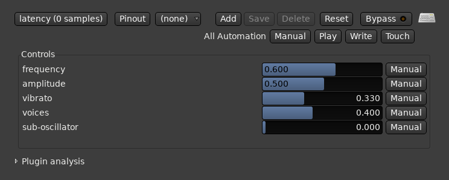

osccontrol-light - An audio plugin that speaks OSC
===============================================

This software enables sending and receiving of Open Sound Control
(OSC) messages from audio plugin host environments such as digital
audio workstations (DAW).

Controls are tied to OSC messages directly in the host environment
without encoding the control data as MIDI CC messages. This way,
control automation can be sent and received via OSC at
full resolution, and all time sequencing, automation recording,
modulation and side-chaining functionality of the host environment can
be used for external OSC control.

We provide an interactive GUI version, as a plugin as well as a
standalone application, that enables prototyping of control presets by
quick switching and reloading of preset definitions.  To integrate a
preset into a host environment with automatable controls, the non-GUI
version of the plugin can be pre-built to load a specific preset
definition at runtime.

Control presets are defined in a concise YAML-based textual markup
format.


Usage
-----

To run the standalone GUI application, execute the
`osccontrol-light-gui` application binary. To run the GUI inside a
plugin host, make the `osccontrol-light-gui` plugin available to the
host environment and load it.

The GUI elements are illustrated in the following.



To create a non-GUI instance of the plugin that provides automatable
controls inside an audio plugin host environment, the plugin needs to
be pre-built to load a certain preset file at runtime. See the build
instructions below for details.

In headless mode, controls are exposed directly in the host UI and can
be mapped to controller input or automated and modulated at full
resolution. The following images show an example preset integrated
into different host environments.

<div style="display:flex;">
    
    
</div>




Environment variables:
- `OSCCONTROL_SCALE_FACTOR`: Set UI scale factor for high DPI displays.
- `OSCCONTROL_PRESET_PATH`: Set directory with preset definitions.

The directory specified via the GUI or `OSCCONTROL_PRESET_PATH` will be
searched recursively for `*.yaml` preset definition files.

**Please note: setting `OSCCONTROL_PRESET_PATH` in the environment is
  mandatory for non-GUI mode!**


Preset Definitions
------------------

Control presets are defined in a YAML-based configuration format as
follows. Refer to the [Presets](Presets) folder for more examples.


```
network:
  host: 127.0.0.1
  port: 6789

controls:
  - name: frequency
    type: float
    default: 440
    range: [100, 2000]
    message: /synth/freq

  - name: amplitude
    type: float
    default: 0.8
    message: /synth/amplitude

  - name: vibrato
    type: float
    default: 0.0
    message: /synth/vibrato

  - name: voices
    type: int
    default: 1
    range: [1, 6]
    message: /synth/voices

  - name: sub-oscillator
    type: toggle
    default: off
    message: /synth/sub-osc
```

Continuous `float`, discrete `int`, and boolean `toggle` control types are currently supported.


Platform Support
----------------

Different plugin SDKs are supported via the [JUCE](https://juce.com/)
library (VST, VST3, AU, RTAS and AAX), as well as all major operating
systems (GNU/Linux, MacOS and Microsoft Windows). The build is
currently preconfigured to build VST3 plugins on all platforms, but
this can be customized by adapting the `CMakeLists.txt` file
accordingly.


Compilation
-----------

The plugin is built using the [CMake](https://cmake.org/) build
system. JUCE therefore needs to be properly deployed using CMake,
using the Projucer is not supported.

First, download a copy of JUCE, or clone the [github
repository](https://github.com/juce-framework/JUCE.git), and install
it to a desired location.

```
git clone https://github.com/juce-framework/JUCE.git
mkdir JUCE/build
cd JUCE/build
cmake ..
cmake --install . --prefix <juce_install_root>
```

[yaml-cpp](https://github.com/jbeder/yaml-cpp) is required as an
additional dependency. Install it via your distribution or manually by
following the instruction on the project page.

If either JUCE or yaml-cpp is installed in a non-standard location,
remember to set `CMAKE_PREFIX_PATH` or `*_DIR` or similar, such
that CMake is able to pick up the installation location.

We provide a script to build different versions of this plugin, which
are preconfigured to load custom YAML presets at runtime. The
interactive GUI version is always built, as VST plugin as well as a
standalone application. To build the GUI version (plugin and
standalone), and plugins for the `simple-synth` and `track-1` presets,
just call the build script as follows.

```
./build_plugins.sh simple-synth track-1
```

Afterwards, you can find the prebuilt plugins for each preset as well
as the GUI version in the `Plugins` directory in the top-level source
tree.

You can perform a parallel build by passing the `-j` option with the
desired number of threads.  To see all available options, call the
build script with the `-h` option.


Licensing
---------

This program is free software: you can redistribute it and/or modify
it under the terms of the GNU General Public License as published by
the Free Software Foundation, either version 3 of the License, or (at
your option) any later version. 

See the [LICENSE](LICENSE) file for more details.
